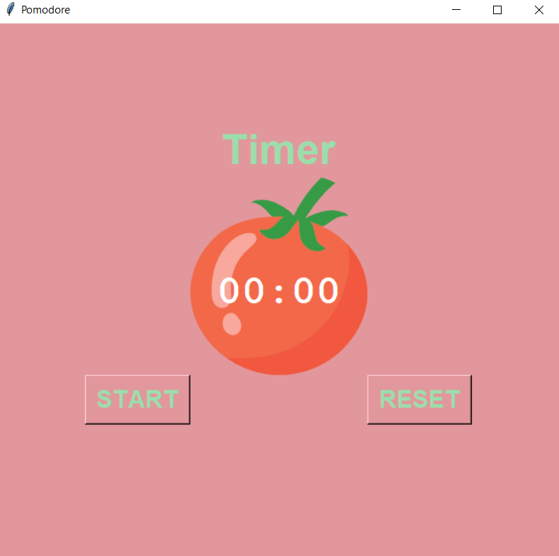
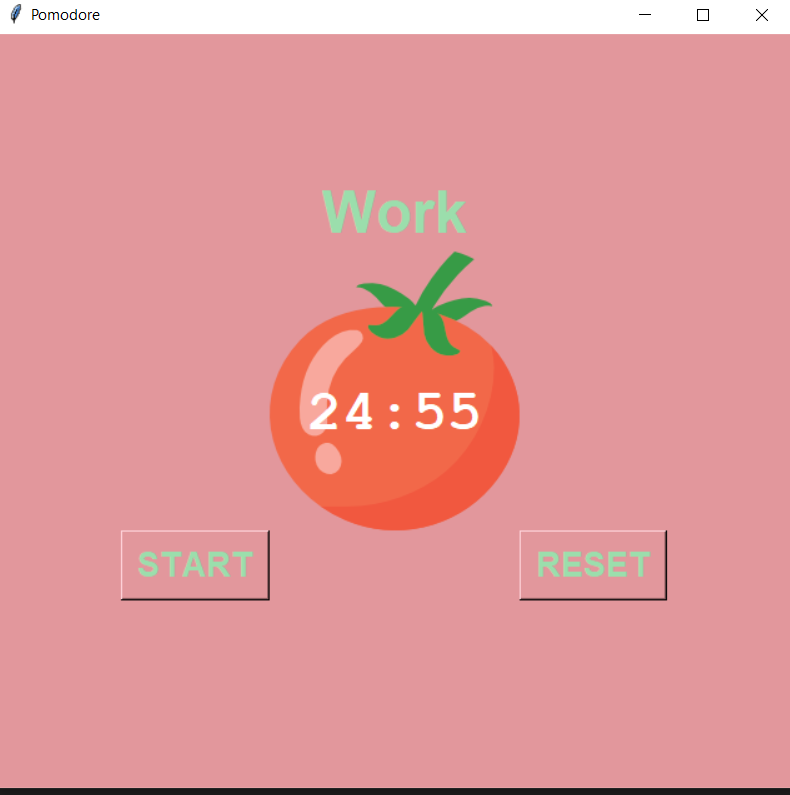
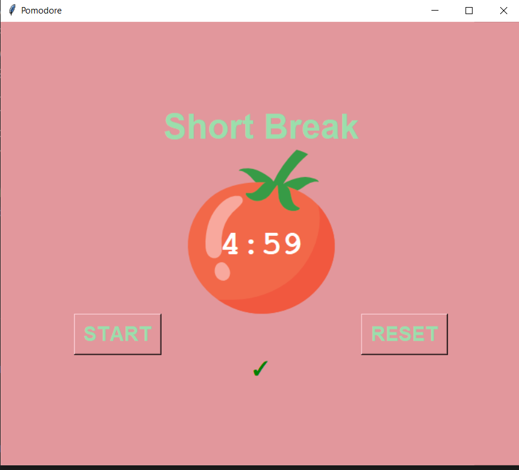

# Pomodoro-Timer

### A simple Pomodoro App created using Tkinter GUI python library
### The Timer got 3 cycles each lasts for 25 minutes, at the end of each cycle a green 'tick' is added at the bottom to show the number of cycles passed.
### At the end of each cycle except for the last one a 5 minute long break gets displayed.
### At the end of the third and last cycle a 15 minute break gets displayed.

#------------------------------

#------------------------------

